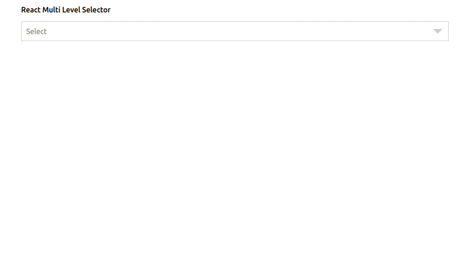

# react-select-multi-level

:bell: React component for Multi level options Selector for your application.



## Installation

```bash
npm install --save react-select-multi-level
```

## Usage

```Javascript
import React from 'react';
import MultiLevelSelect from 'react-select-multi-level';

const options = [
  { value: 'fruits', label: 'Fruits',
    options: [
      { value: 'citrus', label: 'Citrus',
        options: [
          { value: 'orange', label: 'Orange' },
          { value: 'grapefruits', label: 'GrapeFruits'},
        ],
      },
      { value: 'tropical', label: 'Tropical',
        options: [
          { value: 'mango', label: 'Mango' },
          { value: 'papaya', label: 'Papaya' },
        ],
      },
      { value: 'berries', label: 'Berries',
        options: [
          { value: 'strawberry', label: 'Strawberry' },
          { value: 'raspberries', label: 'Raspberries' },
        ],
      },
    ],
  },
  { value: 'city', label: 'City',
    options: [
      { value: 'dublin', label: 'Dublin' },
      { value: 'new york', label: 'New York' },
      { value: 'san fransis', label: 'San Fransis' },
    ],
  },

function App() {
  return (
    <div>
      <MultiLevelSelect
        options={options}
      />
      <div>This is a test application</div>
    </div>
  )
}

export default App;
```

## Props

| Name              | Type         | Description                                                             |
| ----------------- | ------------ | ----------------------------------------------------------------------- |
| **`options`**     | `{Array}`    | Options for the dropdown. Specify the options for users to select from. |
| **`placeholder`** | `{String}`   | The text displayed when no option is selected.                          |
| **`onChange`**    | `{function}` | Subscribe to change events.                                             |
| **`className`**   | `{String}`   | className to style the selector                                         |
